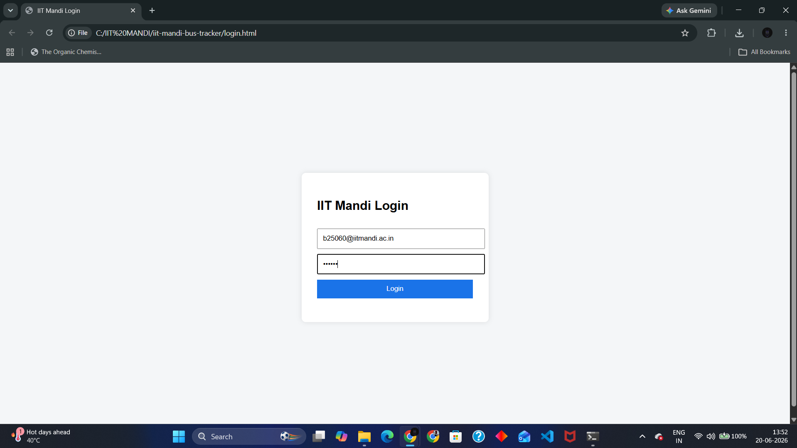
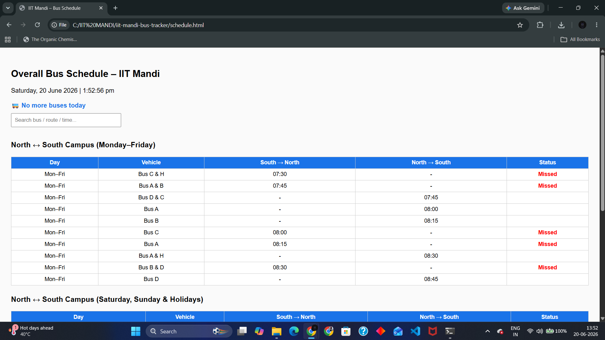
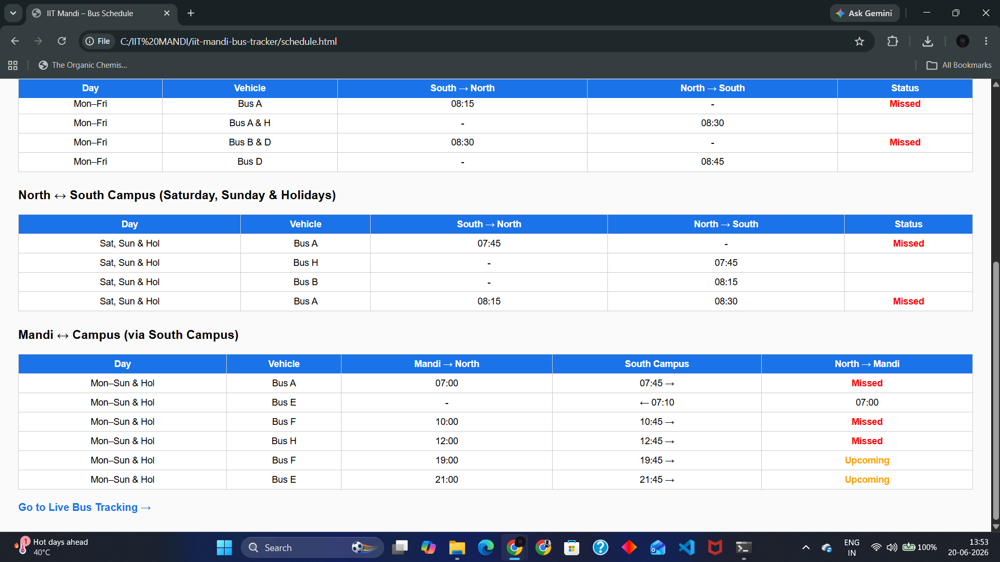
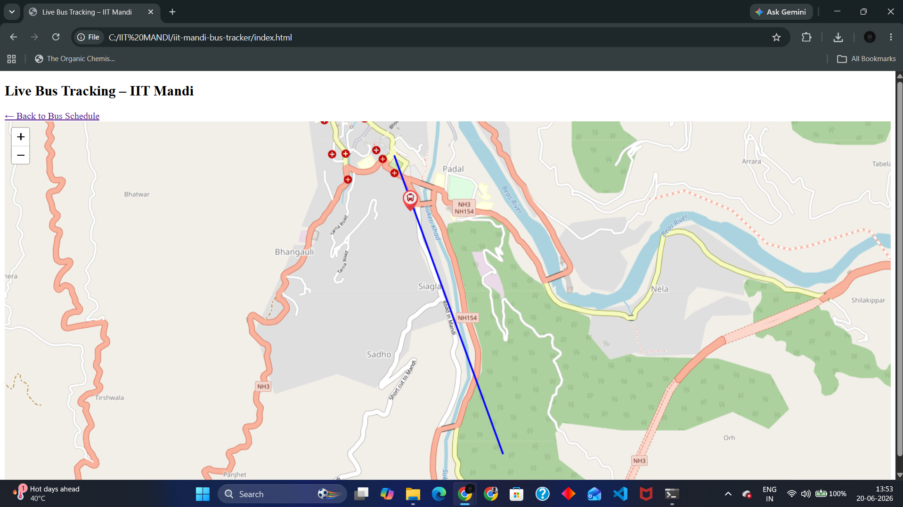
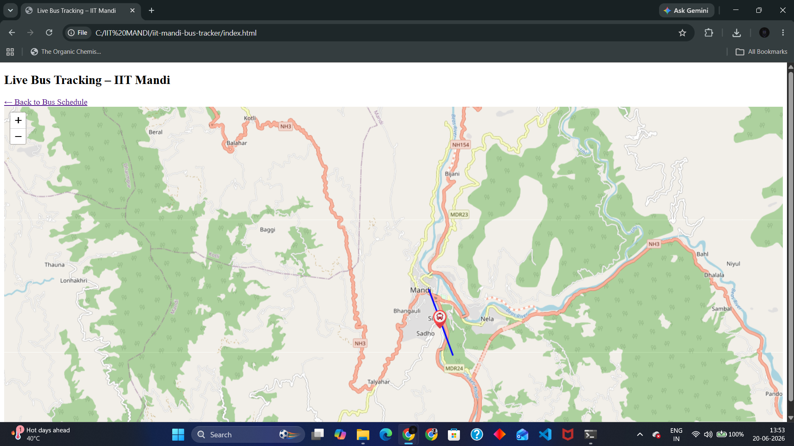
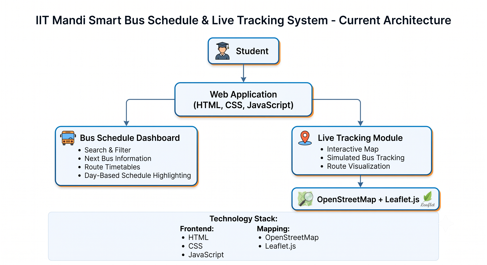

# 🚌 IIT Mandi Smart Bus Schedule & Live Tracking System

A web-based smart transportation platform designed to improve bus accessibility and reduce uncertainty for students travelling across IIT Mandi campuses.

## 📌 Problem Statement

IIT Mandi consists of three major locations:

* North Campus
* South Campus
* Mandi Town

Students frequently travel between these locations. However, bus schedules are usually shared through notices or PDFs, making it difficult to know:

* When the next bus will arrive
* Whether a bus is delayed
* Which route is currently available

This often results in missed buses, unnecessary waiting time, and confusion.

## 💡 Proposed Solution

The Smart Bus Schedule & Live Tracking System digitizes bus schedules and introduces real-time tracking capabilities through a web-based platform.

The project aims to provide:

* Centralized bus schedules
* Searchable routes and timings
* Next bus prediction
* Live bus tracking
* Future GPS-based location updates

## 🚀 Features

### 🔐 College Login System

* IIT Mandi email validation
* Session-based authentication
* Redirect to dashboard after login

### 📅 Smart Bus Schedule Dashboard

* Live date and time display
* Search and filter functionality
* Route-wise timetable
* Day-specific schedule highlighting
* Upcoming and missed bus indicators
* Next Bus Countdown Banner

### 🗺️ Live Tracking Module

* Interactive map interface
* Simulated moving bus
* Route visualization
* Designed for future GPS integration

### 📍 Complete Schedule Digitization

* North Campus ↔ South Campus
* Mandi Town ↔ Campus
* Weekday schedules
* Weekend schedules
* Holiday schedules

## 🏗️ System Architecture

Current Flow:

Student → Website → Schedule Database

Future Flow:

Driver GPS → Firebase → Website → Student

or

GPS Device → Cloud Backend → Website → Student

## 🛠️ Tech Stack

### Frontend

* HTML
* CSS
* JavaScript

### Mapping

* Leaflet.js
* OpenStreetMap

### Planned Integrations

* Google Maps Platform
* Firebase
* Google Cloud Platform
* Google AI

## 🔮 Future Improvements

* Real-time GPS tracking
* Firebase backend integration
* Google Maps route visualization
* Delay prediction using AI
* Push notifications
* Mobile-responsive design
* Android application

## 📷 Screenshots

### Login Page

### Schedule Dashboard

 

### Live Tracking

## System Architecture

## 🚧 Project Status

Current Stage: MVP (Minimum Viable Product)

Implemented:
- Schedule Digitization
- Route Information
- Simulated Bus Tracking
- Search & Filter Functionality

Planned:
- Firebase Integration
- Real-Time GPS Tracking
- Google Maps Integration
- AI-Based Delay Prediction

## 🎯 Motivation

Students frequently travel between North Campus,
South Campus, and Mandi Town.

Due to the absence of a real-time tracking system,
students often face uncertainty regarding bus arrival times
and delays.

This project aims to digitize schedules and provide a
foundation for future live bus tracking.

## 🎯 Hackathon Context

Developed as part of the GDG on Campus TechSprint Hackathon under the Open Innovation theme.

The project focuses on solving a real transportation problem faced by students at IIT Mandi while maintaining scalability for future deployment.

## 👨‍💻 Author

Vedant Nikode

Bioengineering Undergraduate, IIT Mandi

Aspiring Software Engineer
